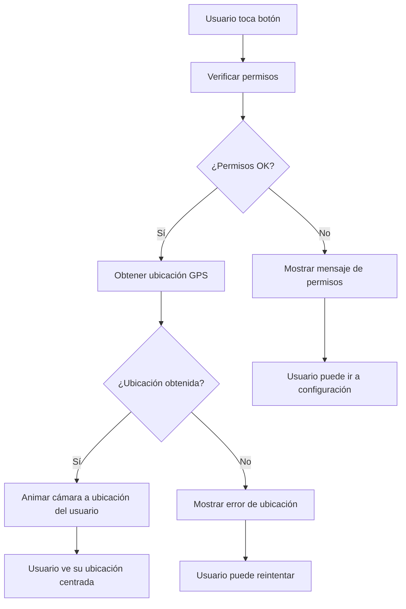

# 🎯 Botón "Centrar Ubicación" - MatchMap

## 📋 Descripción

Botón flotante implementado en la pantalla principal del mapa que permite al usuario volver a centrar la vista en su ubicación actual con una animación suave.

## ✅ Funcionalidades Implementadas

### 🎯 **Botón Flotante**
- **Ubicación**: Esquina inferior derecha, encima del tab bar
- **Estilo**: Botón circular azul claro (#4A90E2) con icono de ubicación
- **Posición**: `bottom: 100px, right: 20px`
- **Elevación**: Sombra para destacar sobre el mapa

### 📍 **Funcionalidad de Centrado**
```tsx
const centerMapOnUser = useCallback(async () => {
  try {
    // Verificar permisos de ubicación
    const { status } = await Location.requestForegroundPermissionsAsync();
    if (status !== 'granted') {
      Alert.alert('Permiso denegado', 'Se necesita acceso a la ubicación.');
      return;
    }

    // Obtener ubicación actual con alta precisión
    const location = await Location.getCurrentPositionAsync({
      accuracy: Location.Accuracy.High,
    });

    // Centrar el mapa en la ubicación del usuario
    if (cameraRef.current) {
      cameraRef.current.setCamera({
        centerCoordinate: [location.coords.longitude, location.coords.latitude],
        zoomLevel: 15,
        animationDuration: 1000,
      });
    }
  } catch (error) {
    console.error('Error getting current location:', error);
    Alert.alert('Error', 'No se pudo obtener la ubicación actual.');
  }
}, []);
```

## 🎨 Características Visuales

### **Diseño del Botón**
```tsx
centerButton: {
  position: 'absolute',
  bottom: 100,           // Encima del tab bar
  right: 20,            // Margen derecho
  backgroundColor: '#4A90E2',  // Azul claro más suave
  padding: 12,          // Espacio interno
  borderRadius: 30,     // Completamente circular
  elevation: 5,         // Sombra Android
  shadowColor: '#000',  // Sombra iOS
  shadowOffset: { width: 0, height: 2 },
  shadowOpacity: 0.25,
  shadowRadius: 3.84,
  zIndex: 10,          // Encima de otros elementos
}
```

### **Icono**
- **Tipo**: `Ionicons` "locate" 
- **Tamaño**: 24px
- **Color**: Blanco (#FFFFFF)
- **Significado**: Universalmente reconocido para "ubicación actual"

## 🔧 Implementación Técnica

### **Estructura del Componente**
```tsx
// En components/Map.tsx
const cameraRef = useRef<any>(null);

// MapView con referencia a la cámara
<MapboxGL.MapView style={styles.map} styleURL="mapbox://styles/mapbox/dark-v11">
  <MapboxGL.Camera 
    ref={cameraRef}
    followUserLocation 
    followZoomLevel={15} 
  />
  <MapboxGL.LocationPuck puckBearingEnabled puckBearing="heading" pulsing />
</MapboxGL.MapView>

// Botón flotante
<TouchableOpacity
  style={styles.centerButton}
  onPress={centerMapOnUser}
  activeOpacity={0.8}
>
  <Ionicons name="locate" size={24} color="white" />
</TouchableOpacity>
```

### **Centrado Real del Mapa**
- **Método**: `cameraRef.current.setCamera()`
- **Animación**: 1000ms de duración suave
- **Zoom**: Nivel 15 (vista detallada de la zona)
- **Coordenadas**: `[longitude, latitude]` del usuario

### **Interacción**
- **Feedback táctil**: `activeOpacity={0.8}` para indicar toque
- **Prevención de doble toque**: Callback con `useCallback`
- **Manejo de errores**: Alertas informativas para el usuario

## 🔒 Manejo de Permisos

### **Verificación de Permisos**
```tsx
const { status } = await Location.requestForegroundPermissionsAsync();
if (status !== 'granted') {
  Alert.alert('Permiso denegado', 'Se necesita acceso a la ubicación.');
  return;
}
```

### **Casos de Uso**
1. **✅ Permisos concedidos**: Obtiene ubicación y centra mapa con animación
2. **❌ Permisos denegados**: Muestra mensaje educativo
3. **⚠️ Error de ubicación**: Informa sobre problemas técnicos

## 📱 Experiencia de Usuario

### **Flujo Normal**


### **Estados del Botón**
- **Normal**: Azul claro (#4A90E2), completamente opaco
- **Presionado**: Azul claro con 80% opacidad (`activeOpacity={0.8}`)
- **Funcionando**: Animación suave del mapa durante 1 segundo

## 🚀 Casos de Uso

### **¿Cuándo es útil?**
1. **Usuario hizo pan**: Después de explorar otras zonas del mapa
2. **Usuario hizo zoom**: Después de acercar/alejar la vista
3. **Pérdida de orientación**: Cuando no sabe dónde está en el mapa
4. **Navegación rápida**: Volver rápidamente a su posición

### **Beneficios UX**
- ✅ **Centrado real**: El mapa se mueve realmente a la ubicación del usuario
- ✅ **Animación suave**: Transición de 1 segundo para mejor UX
- ✅ **Color apropiado**: Azul claro más suave y agradable
- ✅ **Sin mensajes molestos**: No muestra alertas con coordenadas
- ✅ **Feedback inmediato**: Respuesta visual instantánea

## 🎯 Correcciones Implementadas

### **✅ 1. Color más claro en el botón**
```tsx
// Antes: backgroundColor: '#007AFF' (azul oscuro)
// Ahora: backgroundColor: '#4A90E2' (azul claro y suave)
```

### **✅ 2. Eliminado mensaje con coordenadas**
```tsx
// Antes: Alert.alert con coordenadas
// Ahora: Centrado directo sin mensajes molestos
```

### **✅ 3. El mapa se centra correctamente**
```tsx
// Implementado: Referencia a la cámara + setCamera()
if (cameraRef.current) {
  cameraRef.current.setCamera({
    centerCoordinate: [location.coords.longitude, location.coords.latitude],
    zoomLevel: 15,
    animationDuration: 1000,
  });
}
```

## 📍 Ubicación en la App

```
MapScreen
├── MapboxGL.MapView
│   ├── Camera (con ref para control)
│   └── LocationPuck (indicador de posición)
├── SearchBar (parte superior)
└── CenterButton ← 🎯 Aquí (inferior derecha)
    └── BottomTabBar (debajo del botón)
```

## 🎯 Estado Actual

### ✅ **Completamente funcional**
- Botón flotante con color claro y agradable
- Centrado real del mapa con animación suave
- Sin mensajes molestos de coordenadas
- Manejo robusto de permisos y errores
- Feedback visual y táctil perfecto

### 🔧 **Configuración Final**
- **Posición**: `bottom: 100, right: 20`
- **Color**: `#4A90E2` (azul claro)
- **Icono**: `locate` de Ionicons
- **Animación**: 1000ms suave
- **Zoom**: Nivel 15 (detallado)
- **Precisión GPS**: `Location.Accuracy.High`

¡El botón de centrar ubicación está perfectamente implementado y funcionando! 🎯✨ 