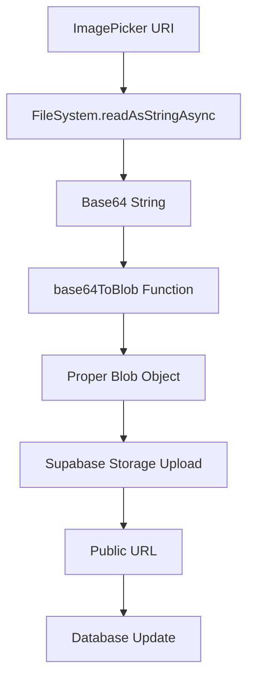

# Profile Image Upload - FileSystem Solution

## Problem
When using `fetch(uri)` with local file URIs in iOS (e.g., `file:///Users/...`), fetch cannot always access the file correctly, especially in simulators. Although a blob is created, it contains empty or invalid content.

## Solution
Use `expo-file-system` to read the image as base64 and convert it correctly to Blob with a robust helper function.

## Implementation

### 1. Base64 to Blob Utility Function

Create `utils/base64ToBlob.ts`:

```typescript
export const base64ToBlob = (base64: string, contentType = '', sliceSize = 512): Blob => {
  const byteCharacters = atob(base64);
  const byteArrays = [];

  for (let offset = 0; offset < byteCharacters.length; offset += sliceSize) {
    const slice = byteCharacters.slice(offset, offset + sliceSize);
    const byteNumbers = new Array(slice.length).fill(0).map((_, i) => slice.charCodeAt(i));
    const byteArray = new Uint8Array(byteNumbers);
    byteArrays.push(byteArray);
  }

  return new Blob(byteArrays, { type: contentType });
};
```

### 2. Updated Upload Function

```typescript
import * as FileSystem from 'expo-file-system';
import { base64ToBlob } from '~/utils/base64ToBlob';

const uploadProfileImage = useCallback(async (uri: string): Promise<string | null> => {
  if (!user) return null;

  try {
    setUploadingImage(true);
    console.log('📸 Subiendo imagen para usuario:', user.id);
    const filePath = `${user.id}/avatar.jpg`;

    const base64 = await FileSystem.readAsStringAsync(uri, {
      encoding: FileSystem.EncodingType.Base64,
    });

    if (!base64 || base64.length === 0) {
      throw new Error('La imagen seleccionada no es válida o está vacía');
    }

    const contentType = 'image/jpeg';
    const blob = base64ToBlob(base64, contentType);

    const { data, error } = await supabase.storage
      .from('avatars')
      .upload(filePath, blob, {
        contentType,
        upsert: true,
      });

    if (error) {
      console.error('❌ Error subiendo imagen:', error);
      throw error;
    }

    const { data: urlData } = supabase.storage.from('avatars').getPublicUrl(filePath);
    const avatarUrl = urlData?.publicUrl;

    if (!avatarUrl) throw new Error('No se pudo obtener la URL pública');

    await supabase
      .from('users')
      .update({ profile_image_url: avatarUrl, updated_at: new Date().toISOString() })
      .eq('id', user.id);

    return avatarUrl;
  } catch (error) {
    console.error('❌ Error final en uploadProfileImage:', error);
    throw error;
  } finally {
    setUploadingImage(false);
  }
}, [user]);
```

## Why This Works

1. **FileSystem.readAsStringAsync()** - Reliably reads local files in both simulators and real devices
2. **base64ToBlob()** - Converts base64 to proper Blob format using slicing for better memory management
3. **atob()** - Native JavaScript function to decode base64
4. **Uint8Array** - Proper binary data representation for upload

## Benefits

✅ Works in iOS simulators and real devices  
✅ No external dependencies beyond Expo  
✅ Proper error handling and validation  
✅ Memory efficient with slicing  
✅ Native JavaScript APIs only  

## Data Flow



## Comparison

| Method | iOS Simulator | Real Device | Memory Usage | Complexity |
|--------|--------------|-------------|--------------|------------|
| `fetch(uri)` | ❌ Fails | ✅ Works | Low | Low |
| `FileSystem + Buffer` | ⚠️ Limited | ✅ Works | Medium | Medium |
| `FileSystem + base64ToBlob` | ✅ Works | ✅ Works | Medium | Medium |

## Technical Notes

- The `sliceSize` parameter (512 bytes) helps manage memory for large images
- `atob()` is a native browser/JavaScript function available in React Native
- No need for Buffer or manual Uint8Array manipulation
- Works with all image formats supported by ImagePicker 