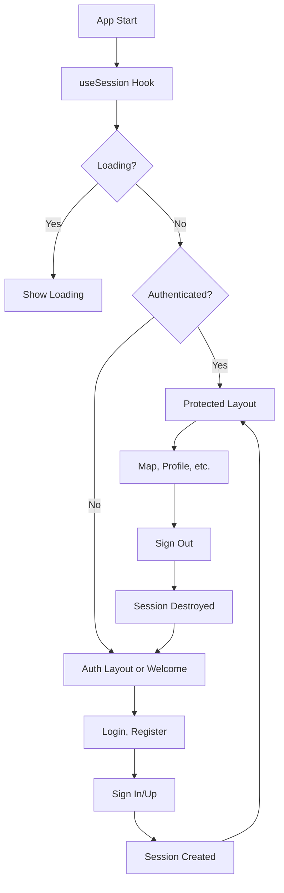

# 🔐 Sistema de Protección de Rutas - MatchMap

## 📋 Descripción

Sistema robusto de protección de rutas que previene accesos no deseados basado en el estado de autenticación del usuario.

## 🛡️ Componentes del Sistema

### 1. **Hook `useSession`** (`hooks/useSession.ts`)
- Maneja el estado global de la sesión
- Escucha cambios de autenticación en tiempo real
- Proporciona `session`, `loading`, e `isAuthenticated`

### 2. **Layout de Autenticación** (`app/(auth)/_layout.tsx`)
- **Protege**: Rutas `/login` y `/register`
- **Bloquea**: Usuarios autenticados accediendo a pantallas de auth
- **Redirige**: Usuarios autenticados → `/(protected)/map`

### 3. **Layout Protegido** (`app/(protected)/_layout.tsx`)
- **Protege**: Rutas del área privada (`/map`, `/profile`, etc.)
- **Bloquea**: Usuarios no autenticados accediendo al área privada
- **Redirige**: Usuarios no autenticados → `/` (WelcomeScreen)

### 4. **Componente `AuthGuard`** (`components/AuthGuard.tsx`)
- Protección adicional para rutas específicas
- Configurable para requerir o rechazar autenticación

## 🚀 Flujo de Navegación

### Usuario No Autenticado:
```
/ (WelcomeScreen) → /(auth)/login → /(protected)/map
                  → /(auth)/register → /(protected)/map
```

### Usuario Autenticado:
```
/ → /(protected)/map (automático)
/(auth)/login → /(protected)/map (bloqueado)
/(auth)/register → /(protected)/map (bloqueado)
```

## 📱 Estados de la Aplicación

### 🔄 **Loading**
- Se muestra `ActivityIndicator` mientras se verifica la sesión
- Evita parpadeos y transiciones bruscas

### ✅ **Autenticado**
- Acceso completo al área `/(protected)/`
- Bloqueado del área `/(auth)/`

### ❌ **No Autenticado**
- Acceso solo a `/` y `/(auth)/`
- Bloqueado del área `/(protected)/`

## 🔧 Uso del Sistema

### Protección Automática
Los layouts manejan automáticamente la protección:

```tsx
// ✅ Automático - No requiere código adicional
// Los usuarios autenticados no pueden acceder a /login
// Los usuarios no autenticados no pueden acceder a /map
```

### Protección Manual (si es necesaria)
```tsx
import { AuthGuard } from '~/components/AuthGuard';

export default function SpecialScreen() {
  return (
    <AuthGuard requireAuth={true} redirectTo="/custom-redirect">
      <YourComponent />
    </AuthGuard>
  );
}
```

### Hook de Sesión
```tsx
import { useSession } from '~/hooks/useSession';

export default function MyComponent() {
  const { session, loading, isAuthenticated } = useSession();
  
  if (loading) return <Loading />;
  
  return (
    <View>
      {isAuthenticated ? <AuthenticatedView /> : <GuestView />}
    </View>
  );
}
```

## 🎯 Beneficios

### ✅ **Seguridad**
- Previene acceso no autorizado
- Manejo consistente de estados de auth

### ✅ **UX Mejorada**
- Sin navegación confusa
- Transiciones fluidas entre estados

### ✅ **Mantenibilidad**
- Sistema centralizado
- Fácil de extender y modificar

### ✅ **Performance**
- Un solo listener de auth por app
- Estados compartidos eficientemente

## 🚫 Problemas Solucionados

1. **❌ Antes**: Usuario autenticado podía volver a `/login`
   **✅ Ahora**: Redirección automática a `/map`

2. **❌ Antes**: Usuario no autenticado podía acceder a `/profile`
   **✅ Ahora**: Redirección automática a `/`

3. **❌ Antes**: Estados inconsistentes de auth
   **✅ Ahora**: Estado global sincronizado

4. **❌ Antes**: Múltiples listeners de auth
   **✅ Ahora**: Un solo hook centralizado

## 🔄 Flujo de Autenticación Completo



## 📝 Configuración

### Rutas Protegidas
Agregar nuevas rutas al directorio `app/(protected)/`:
```
app/(protected)/
  ├── _layout.tsx (protección automática)
  ├── map.tsx
  ├── profile.tsx
  └── nueva-ruta.tsx ✅ Automáticamente protegida
```

### Rutas de Autenticación
Agregar nuevas rutas al directorio `app/(auth)/`:
```
app/(auth)/
  ├── _layout.tsx (protección automática)
  ├── login.tsx
  ├── register.tsx
  └── forgot-password.tsx ✅ Automáticamente protegida
```

¡El sistema está completamente configurado y funcionando! 🎉 